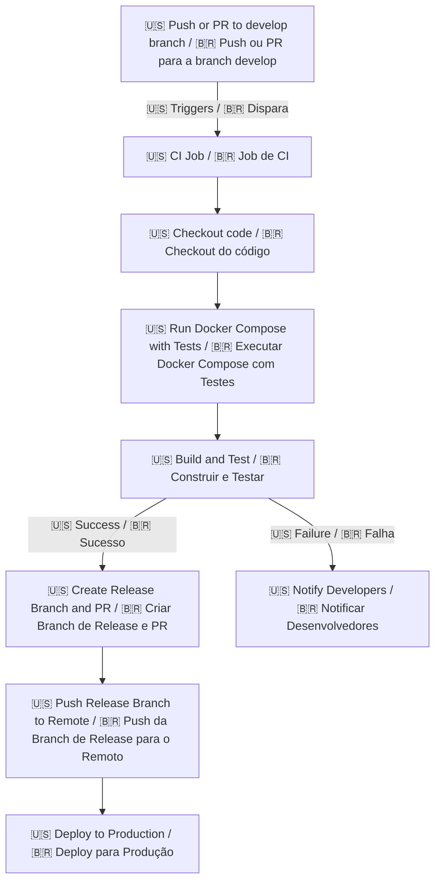
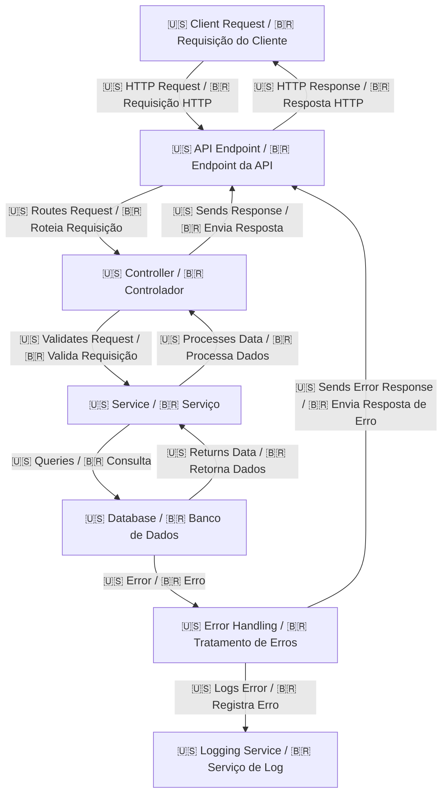

# API-Node-Express

🇺🇸 This is an API built with Express and TypeScript, providing a simple user management system. The API includes endpoints for creating, reading, updating, and deleting users, and it also includes Swagger documentation.

🇧🇷 Esta é uma API construída com Express e TypeScript, fornecendo um sistema simples de gerenciamento de usuários. A API inclui endpoints para criar, ler, atualizar e excluir usuários, e também inclui documentação Swagger.

## Features / Funcionalidades

- 🇺🇸 Create, read, update, and delete users
- 🇧🇷 Criar, ler, atualizar e excluir usuários
- 🇺🇸 Swagger API documentation
- 🇧🇷 Documentação da API Swagger
- 🇺🇸 Docker support
- 🇧🇷 Suporte ao Docker

## Prerequisites / Pré-requisitos

- 🇺🇸 Node.js
- 🇧🇷 Node.js
- 🇺🇸 npm
- 🇧🇷 npm
- 🇺🇸 Docker (optional)
- 🇧🇷 Docker (opcional)

## Getting Started / Começando

### Installation / Instalação

1. 🇺🇸 Clone the repository:
   🇧🇷 Clone o repositório:
   ```bash
   git clone https://github.com/yourusername/api-node-express.git
   cd api-node-express
   ```

2. 🇺🇸 Install dependencies:
   🇧🇷 Instale as dependências:
   ```bash
   npm install
   ```

### Running the API / Executando a API

#### Development / Desenvolvimento

🇺🇸 To run the API in development mode with hot-reloading:
🇧🇷 Para executar a API em modo de desenvolvimento com recarregamento automático:

```bash
npm run dev
```

#### Production / Produção

🇺🇸 To build and run the API in production mode:
🇧🇷 Para construir e executar a API em modo de produção:

```bash
npm run build
npm start
```

### Docker

🇺🇸 To run the API using Docker:
🇧🇷 Para executar a API usando Docker:

1. 🇺🇸 Build and start the Docker containers:
   🇧🇷 Construa e inicie os contêineres Docker:
   ```bash
   docker-compose up --build
   ```

2. 🇺🇸 The API will be available at `http://localhost:3000`.
   🇧🇷 A API estará disponível em `http://localhost:3000`.

### Running Tests / Executando Testes

#### Jest

🇺🇸 To run the Jest tests:
🇧🇷 Para executar os testes Jest:

```bash
npm test
```

#### Cypress

🇺🇸 To open the Cypress test runner:
🇧🇷 Para abrir o executor de testes Cypress:

```bash
npm run cypress:open
```

🇺🇸 To run the Cypress tests in headless mode:
🇧🇷 Para executar os testes Cypress em modo headless:

```bash
npm run cypress:run
```

### API Documentation / Documentação da API

🇺🇸 The API documentation is available at `http://localhost:3000/api-docs` when the server is running.
🇧🇷 A documentação da API está disponível em `http://localhost:3000/api-docs` quando o servidor está em execução.

## Project Structure / Estrutura do Projeto

- `src/`: 🇺🇸 Source code / 🇧🇷 Código fonte
  - `controllers/`: 🇺🇸 Request handlers / 🇧🇷 Manipuladores de requisições
  - `models/`: 🇺🇸 Data models / 🇧🇷 Modelos de dados
  - `routes/`: 🇺🇸 API routes / 🇧🇷 Rotas da API
  - `services/`: 🇺🇸 Business logic / 🇧🇷 Lógica de negócios
- `dist/`: 🇺🇸 Compiled code / 🇧🇷 Código compilado
- `docker-compose.yml`: 🇺🇸 Docker Compose configuration / 🇧🇷 Configuração do Docker Compose
- `Dockerfile`: 🇺🇸 Docker image configuration / 🇧🇷 Configuração da imagem Docker
- `package.json`: 🇺🇸 Project metadata and scripts / 🇧🇷 Metadados e scripts do projeto
- `tsconfig.json`: 🇺🇸 TypeScript configuration / 🇧🇷 Configuração do TypeScript

## Pipeline Flow / Fluxo do Pipeline



## Project Flow / Fluxo do Projeto



### Component Descriptions / Descrições dos Componentes

- **Client Request / Requisição do Cliente**: 🇺🇸 The initial request made by the client to the API. / 🇧🇷 A requisição inicial feita pelo cliente para a API.
- **API Endpoint / Endpoint da API**: 🇺🇸 The specific URL that the client interacts with. / 🇧🇷 A URL específica com a qual o cliente interage.
  - **Routes / Rotas**:
    - 🇺🇸 `POST /users`: Create a new user / 🇧🇷 Criar um novo usuário
    - 🇺🇸 `GET /users`: Retrieve all users / 🇧🇷 Recuperar todos os usuários
    - 🇺🇸 `GET /users/:id`: Retrieve a specific user / 🇧🇷 Recuperar um usuário específico
    - 🇺🇸 `PUT /users/:id`: Update a specific user / 🇧🇷 Atualizar um usuário específico
    - 🇺🇸 `DELETE /users/:id`: Delete a specific user / 🇧🇷 Excluir um usuário específico
- **Controller / Controlador**: 🇺🇸 Handles the incoming request, validates it, and calls the appropriate service. / 🇧🇷 Lida com a requisição recebida, valida e chama o serviço apropriado.
- **Service / Serviço**: 🇺🇸 Contains the business logic and interacts with the database. / 🇧🇷 Contém a lógica de negócios e interage com o banco de dados.
- **Database / Banco de Dados**: 🇺🇸 Stores and retrieves data. / 🇧🇷 Armazena e recupera dados.
- **Error Handling / Tratamento de Erros**: 🇺🇸 Manages any errors that occur during the request processing. / 🇧🇷 Gerencia quaisquer erros que ocorram durante o processamento da requisição.
- **Logging Service / Serviço de Log**: 🇺🇸 Logs errors and other important information. / 🇧🇷 Registra erros e outras informações importantes.

### Possible Outcomes / Resultados Possíveis

- **Success / Sucesso**: 🇺🇸 The request is processed successfully, and the client receives the expected response. / 🇧🇷 A requisição é processada com sucesso e o cliente recebe a resposta esperada.
  - 🇺🇸 **200 OK**: Successful GET, PUT, DELETE requests / 🇧🇷 Requisições GET, PUT, DELETE bem-sucedidas
  - 🇺🇸 **201 Created**: Successful POST request / 🇧🇷 Requisição POST bem-sucedida
- **Validation Error / Erro de Validação**: 🇺🇸 The request is invalid, and an error response is sent back to the client. / 🇧🇷 A requisição é inválida e uma resposta de erro é enviada de volta ao cliente.
  - 🇺🇸 **400 Bad Request**: Invalid request data / 🇧🇷 Dados de requisição inválidos
- **Database Error / Erro de Banco de Dados**: 🇺🇸 An error occurs while querying the database, and an error response is sent back to the client. / 🇧🇷 Ocorre um erro ao consultar o banco de dados e uma resposta de erro é enviada de volta ao cliente.
  - 🇺🇸 **500 Internal Server Error**: Database query error / 🇧🇷 Erro de consulta ao banco de dados
- **Unhandled Error / Erro Não Tratado**: 🇺🇸 An unexpected error occurs, and an error response is sent back to the client. / 🇧🇷 Ocorre um erro inesperado e uma resposta de erro é enviada de volta ao cliente.
  - 🇺🇸 **500 Internal Server Error**: Unexpected server error / 🇧🇷 Erro inesperado do servidor


