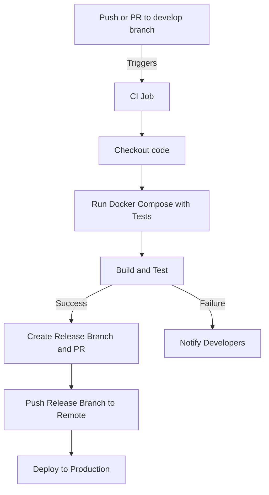
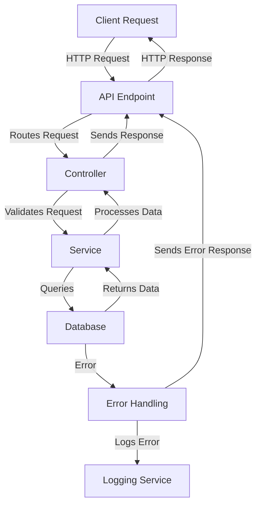

# API-Node-Express

This is an API built with Express and TypeScript, providing a simple user management system. The API includes endpoints for creating, reading, updating, and deleting users, and it also includes Swagger documentation.

## Features

- Create, read, update, and delete users
- Swagger API documentation
- Docker support

## Prerequisites

- Node.js
- npm
- Docker (optional)

## Getting Started

### Installation

1. Clone the repository:
   ```bash
   git clone https://github.com/yourusername/api-node-express.git
   cd api-node-express
   ```

2. Install dependencies:
   ```bash
   npm install
   ```

### Running the API

#### Development

To run the API in development mode with hot-reloading:

```bash
npm run dev
```

#### Production

To build and run the API in production mode:

```bash
npm run build
npm start
```

### Docker

To run the API using Docker:

1. Build and start the Docker containers:
   ```bash
   docker-compose up --build
   ```

2. The API will be available at `http://localhost:3000`.

### Running Tests

#### Jest

To run the Jest tests:

```bash
npm test
```

#### Cypress

To open the Cypress test runner:

```bash
npm run cypress:open
```

To run the Cypress tests in headless mode:

```bash
npm run cypress:run
```

### API Documentation

The API documentation is available at `http://localhost:3000/api-docs` when the server is running.

## Project Structure

- `src/`: Source code
  - `controllers/`: Request handlers
  - `models/`: Data models
  - `routes/`: API routes
  - `services/`: Business logic
- `dist/`: Compiled code
- `docker-compose.yml`: Docker Compose configuration
- `Dockerfile`: Docker image configuration
- `package.json`: Project metadata and scripts
- `tsconfig.json`: TypeScript configuration

## Pipeline Flow



## Project Flow



### Component Descriptions

- **Client Request**: The initial request made by the client to the API.
- **API Endpoint**: The specific URL that the client interacts with.
  - **Routes**:
    - `POST /users`: Create a new user
    - `GET /users`: Retrieve all users
    - `GET /users/:id`: Retrieve a specific user
    - `PUT /users/:id`: Update a specific user
    - `DELETE /users/:id`: Delete a specific user
- **Controller**: Handles the incoming request, validates it, and calls the appropriate service.
- **Service**: Contains the business logic and interacts with the database.
- **Database**: Stores and retrieves data.
- **Error Handling**: Manages any errors that occur during the request processing.
- **Logging Service**: Logs errors and other important information.

### Possible Outcomes

- **Success**: The request is processed successfully, and the client receives the expected response.
  - **200 OK**: Successful GET, PUT, DELETE requests
  - **201 Created**: Successful POST request
- **Validation Error**: The request is invalid, and an error response is sent back to the client.
  - **400 Bad Request**: Invalid request data
- **Database Error**: An error occurs while querying the database, and an error response is sent back to the client.
  - **500 Internal Server Error**: Database query error
- **Unhandled Error**: An unexpected error occurs, and an error response is sent back to the client.
  - **500 Internal Server Error**: Unexpected server error

## License

This project is licensed under the MIT License.
